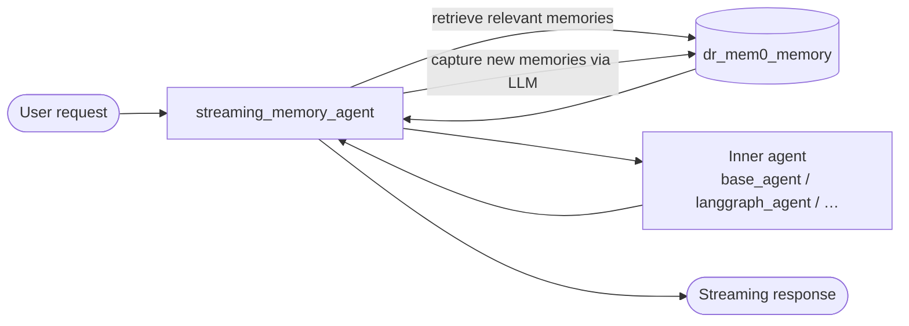

# Agent memory

> **Also known as:** persistent memory, long-term memory, user memory, mem0, DataRobot memory service, conversation memory

The agent template can wire in **persistent, per-user memory** so the agent recalls facts across conversations. Memory is configured at project generation time with the Copier variable `use_agent_memory` and implemented declaratively in `workflow.yaml`.

> [!IMPORTANT]
> Memory runs on the [DRAgent front server](./README.md#front-server) (the only supported front server). The deprecated DRUM fallback (`ENABLE_DRAGENT_SERVER=false`) does **not** load the memory wrapper — leave DRAgent enabled if you rely on memory.

Memory is **not** implemented in `myagent.py`. The template wraps your framework agent in a `streaming_memory_agent` workflow that automatically retrieves relevant memories before each turn and captures new ones after.

| Section | Description |
|---|---|
| [Enabling memory at generation time](#enabling-memory-at-generation-time) | The `use_agent_memory` Copier variable and provider choices. |
| [How the memory interface works](#how-the-memory-interface-works) | `streaming_memory_agent`, `dr_mem0_memory`, and per-user scoping. |
| [Workflow configuration](#workflow-configuration) | What changes in `workflow.yaml` when memory is enabled. |
| [Memory providers](#memory-providers) | Mem0 vs DataRobot Memory Service. |
| [Configuration and runtime parameters](#configuration-and-runtime-parameters) | TTL, credentials, and memory space settings. |
| [Infrastructure provisioning](#infrastructure-provisioning) | What Pulumi creates for each provider. |
| [Local development](#local-development) | Environment variables and DRAgent requirements. |
| [Migrating from legacy answers](#migrating-from-legacy-answers) | Upgrading projects that used a boolean `use_agent_memory` flag. |

---

## Enabling memory at generation time

When you generate or update a project with Copier, you are prompted to choose an agent memory provider. The answer is stored in `.datarobot/answers/agent-*.yml` as `use_agent_memory`.

| Copier choice | Stored value | Description |
|---|---|---|
| **None** | `none` | Default. No memory dependency or workflow changes. |
| **Mem0** | `mem0` | External [Mem0](https://mem0.ai/) service. Requires a Mem0 API key. |
| **Datarobot Memory Service** | `datarobot_memory_service` | DataRobot-managed memory space provisioned by Pulumi with its own LLM routing (defaults to the agent LLM component when it uses LLM Gateway or a deployed LLM; see [Memory space LLM (DataRobot Memory Service)](#llm-configuration)). |

When the agent LLM uses LLM Gateway or a deployed LLM, the memory space reuses that configuration automatically&mdash;no extra prompts. When the LLM component uses **External LLM** (`blueprint_with_external_llm.py`), `dr start` / `dr dotenv setup` asks for a dedicated memory-space LLM (gateway model or deployment ID). You can also set `AGENT_MEMORY_LLM_MODEL_NAME` or `AGENT_MEMORY_LLM_DEPLOYMENT_ID` in `.env` at any time to override memory-space routing.

To pass the value non-interactively:

```sh
uvx copier copy . ./my-agent --data use_agent_memory=mem0
```

Valid values are `none`, `mem0`, and `datarobot_memory_service`.

When memory is enabled (`mem0` or `datarobot_memory_service`), the template also:

- Adds the `memory` extra to the `datarobot-genai` dependency in `pyproject.toml`.
- Selects a memory-aware `uv.lock` partial.
- Adds memory-related fields to `agent/config.py`.
- Provisions provider-specific runtime parameters in infrastructure code.

---

## How the memory interface works

Agent memory in this template is built on two NAT workflow types from `datarobot-genai`:

| Component | `_type` | Role |
|---|---|---|
| **Memory backend** | `dr_mem0_memory` | Stores and retrieves memories for the current user. Despite the name, this backend works with both Mem0 and the DataRobot Memory Service&mdash;the provider is selected at runtime from environment variables and credentials. |
| **Memory wrapper** | `streaming_memory_agent` | Wraps your inner agent. Before each turn it searches memory for relevant context; after each turn it uses an LLM to extract and store durable facts. |



### Per-user scoping

`streaming_memory_agent` is registered as a **per-user** function. Each authenticated user gets an isolated memory namespace, so memories from one user are not visible to another.

### Automatic capture and retrieval

You do not call memory APIs from application code. The wrapper:

1. **Retrieves**&mdash;searches stored memories for entries relevant to the current user message and injects them into the agent context.
2. **Captures**&mdash;after the inner agent responds, uses the configured LLM to decide which parts of the exchange are worth persisting, then writes them to the memory backend.

The LLM used for capture and retrieval is the workflow `llm_name` (typically `datarobot_llm`).

### DRAgent requirement

Memory is configured entirely in `workflow.yaml` and runs through DRAgent middleware. The deprecated DRUM fallback (`ENABLE_DRAGENT_SERVER=false`) does not load the memory wrapper, so memory is silently disabled if you fall back to DRUM. See [Front server](./README.md#front-server).

> [!NOTE]
> When memory is enabled, the generated `workflow.yaml` uses `streaming_memory_agent` as the top-level workflow type instead of the framework agent type directly (for example `langgraph_agent` or `per_user_tool_calling_agent`). Your framework-specific agent moves into the `functions` section as the `inner_agent_name`.

---

## Workflow configuration

When `use_agent_memory` is `mem0` or `datarobot_memory_service`, every framework template emits the same memory pattern in `workflow.yaml`. The inner agent definition moves under `functions`; the top-level `workflow` block becomes a memory wrapper.

### Example (base framework)

**Without memory** (`use_agent_memory: none`):

```yaml
workflow:
  _type: base_agent
  llm_name: datarobot_llm
  description: Base agent example
  middleware:
    - datarobot_moderation
```

**With memory** (`use_agent_memory: mem0` or `datarobot_memory_service`):

```yaml
functions:
  base_agent:
    _type: base_agent
    llm_name: datarobot_llm
    description: Base agent example

memory:
  mem0_memory:
    _type: dr_mem0_memory

workflow:
  _type: streaming_memory_agent
  inner_agent_name: base_agent
  memory_name: mem0_memory
  llm_name: datarobot_llm
  description: Base agent example with automatic memory capture and retrieval
```

### Workflow fields

| Field | Description |
|---|---|
| `inner_agent_name` | Name of the function in `functions` that performs the actual agent work. Matches the framework agent (`base_agent`, `langgraph_agent`, `crewai_agent`, `llamaindex_agent`, or `nat_agent`). |
| `memory_name` | Name of the entry under `memory` that points to the `dr_mem0_memory` backend. The template uses `mem0_memory`. |
| `llm_name` | LLM used by the memory wrapper for retrieval ranking and post-turn memory extraction. |

### Framework-specific inner agents

| Framework | `inner_agent_name` | Inner `_type` |
|---|---|---|
| Base | `base_agent` | `base_agent` |
| LangGraph | `langgraph_agent` | `langgraph_agent` |
| CrewAI | `crewai_agent` | `crewai_agent` |
| LlamaIndex | `llamaindex_agent` | `llamaindex_agent` |
| NAT | `nat_agent` | `per_user_tool_calling_agent` |

For NAT, the inner `per_user_tool_calling_agent` retains its `tool_names` (planner, writer, MCP tools, and so on). The outer `streaming_memory_agent` adds memory on top without changing tool wiring.

---

## Memory providers

Both providers use the same `dr_mem0_memory` workflow type and `streaming_memory_agent` wrapper. The provider is determined at runtime from credentials and environment variables.

| | **Mem0** (`mem0`) | **DataRobot Memory Service** (`datarobot_memory_service`) |
|---|---|---|
| **Backend** | Mem0 cloud API | DataRobot Memory Space (provisioned in your tenant) |
| **Credential** | `MEM0_API_KEY` runtime parameter (API token credential) | None&mdash;uses the deployment's DataRobot API identity |
| **Space ID** | Managed by Mem0 | `AGENT_MEMORY_SPACE_ID` runtime parameter (string) |
| **Backend LLM** | Managed by Mem0 | Memory space LLM&mdash;defaults to the agent LLM component, configurable independently (see [Memory space LLM (DataRobot Memory Service)](#llm-configuration)) |
| **Feature flag** | None | `ENABLE_AGENTIC_MEMORY_API: true` in deployment feature flags |
| **Infra action** | Stores Mem0 API key from `MEM0_API_KEY` env at deploy time | Creates a `MemorySpace` Pulumi resource, configures its LLM routing, and injects its ID |

Choose **Mem0** when you already use Mem0 or want a third-party memory service. Choose **DataRobot Memory Service** to keep memory entirely within your DataRobot environment with no external API key.

> [!NOTE]
> External provider credentials without a DataRobot LLM deployment (for example a blueprint wired to Azure OpenAI credentials) are not supported by the DataRobot Memory Service as the default memory-space LLM. Use **Mem0** for those setups, or configure a dedicated gateway or deployed LLM for the memory space during `dr start` / `dr dotenv setup` when you select External LLM for the agent LLM component.

---

## Configuration and runtime parameters

Memory-related settings are loaded through `agent/config.py` (for TTL) and standard DataRobot runtime parameters (for provider credentials and space ID).

### TTL (time to live)

| Setting | Env / runtime parameter | Default | Description |
|---|---|---|---|
| `agent_memory_default_ttl_seconds` | `AGENT_MEMORY_TTL_SECONDS` | `2592000` (30 days) | How long stored memories are retained before expiration. Set via the `AGENT_MEMORY_TTL_SECONDS` runtime parameter at deploy time or in `.env` for local development. |

The constant `AGENT_MEMORY_TTL_SECONDS` in `config.py` mirrors the default (`2_592_000` seconds).

### Mem0 provider

| Setting | Env / runtime parameter | Description |
|---|---|---|
| `mem0_api_key` | `MEM0_API_KEY` | Mem0 API key. Stored as a DataRobot API token credential in deployed environments. |

### DataRobot Memory Service provider

| Setting | Env / runtime parameter | Description |
|---|---|---|
| &mdash; | `AGENT_MEMORY_SPACE_ID` | UUID of the DataRobot Memory Space. Set automatically by Pulumi; exported as `Agent Memory Space ID <agent_name>`. |

##### Memory space LLM (DataRobot Memory Service)

The memory space has its **own** LLM routing, separate from both the inner agent and the memory wrapper.

Each memory space uses **one** LLM routing mode. Pulumi sets either `llm_model_name` or `llm_base_url` on the space, never both:

| Default source | Memory space field | Value |
|---|---|---|
| **LLM Gateway** (default) | `llm_model_name` | The LLM component's `default_model` with the `datarobot/` prefix stripped. |
| **Deployed LLM** | `llm_base_url` | The deployment chat completions endpoint (`/api/v2/deployments/{id}/chat/completions`). |

To configure a memory space LLM that differs from the agent LLM component, set one of these environment variables:

| Env variable | Routing | Description |
|---|---|---|
| `AGENT_MEMORY_LLM_DEPLOYMENT_ID` | Deployed LLM | DataRobot deployment ID for the memory space. Takes precedence over `AGENT_MEMORY_LLM_MODEL_NAME`. |
| `AGENT_MEMORY_LLM_MODEL_NAME` | LLM Gateway | Gateway model name for the memory space (for example `azure/gpt-5-mini-2025-08-07` or `datarobot/azure/gpt-5-mini-2025-08-07`). |

> [!IMPORTANT]
> For the DataRobot Memory Service provider, do not create the memory space manually unless you are overriding infrastructure defaults. Pulumi creates the space, configures its LLM routing, and wires the ID into the agent deployment.

---

## Infrastructure provisioning

When memory is enabled, `infra/infra/<agent_app_name>.py` adds runtime parameters to the agent custom model:

1. **`AGENT_MEMORY_TTL_SECONDS`**&mdash;always added (string type, default `2592000`). Override at deploy time with the `AGENT_MEMORY_TTL_SECONDS` environment variable in your Pulumi stack.

2. **Provider-specific parameter:**
   - **Mem0**&mdash;`MEM0_API_KEY` credential, created when `MEM0_API_KEY` is set in the Pulumi environment.
   - **DataRobot Memory Service**&mdash;`AGENT_MEMORY_SPACE_ID` string, populated from a `pulumi_datarobot.MemorySpace` resource.

For the DataRobot Memory Service provider, the feature flag `ENABLE_AGENTIC_MEMORY_API` is set to `true` in `infra/feature_flags/<agent_app_name>.yaml` so the deployment can call the agentic memory API.

---

## Local development

1. **Provision and configure memory:**

   **Mem0**&mdash;set your API key in `.env`:
   ```sh
   MEM0_API_KEY=your_mem0_api_key
   ```

   **DataRobot Memory Service**&mdash;run `task deploy-dev` to create the memory space, configure its LLM routing, and write `AGENT_MEMORY_SPACE_ID` to `.env`. You do not need to set the space ID manually.

   Optionally override TTL in `.env`:
   ```sh
   AGENT_MEMORY_TTL_SECONDS=86400
   ```

   Optionally configure the memory space LLM independently of the agent LLM component:
   ```sh
   # LLM Gateway model override
   AGENT_MEMORY_LLM_MODEL_NAME=anthropic/claude-opus-4-20250514

   # or deployed LLM override (takes precedence over model name)
   AGENT_MEMORY_LLM_DEPLOYMENT_ID=your-deployment-id
   ```

2. **Start the agent:**

   ```sh
   dr run agent:dev
   ```

3. **Test with repeated prompts** to verify memory persists across turns for the same user identity.

For Mem0, obtain an API key from the [Mem0 dashboard](https://app.mem0.ai/). For the DataRobot Memory Service, run `task deploy-dev` before `task dev` so the memory space is provisioned and its LLM routing is configured.

---

## Migrating from legacy answers

Older template versions stored `use_agent_memory` as a boolean (`yes`/`no` or `true`/`false`). Copier migrations (version `11.8.28`) rewrite those answers to `none`. To enable memory after migration, set `use_agent_memory` explicitly:

```yaml
use_agent_memory: mem0
# or
use_agent_memory: datarobot_memory_service
```

Then re-run `copier update` to regenerate `workflow.yaml`, `pyproject.toml`, `config.py`, and infrastructure with memory support.

---

## Further reading

| Topic | Description |
|---|---|
| [Agent README](./README.md) | Agent component overview, front servers, and framework guides. |
| [DRAgent front server](./README.md#dragent) | How to enable and use the DRAgent runtime required for memory. |
| [LLM provider fallback](./llm-fallback.md) | Configure primary and fallback LLMs used by the memory wrapper and inner agent. |
