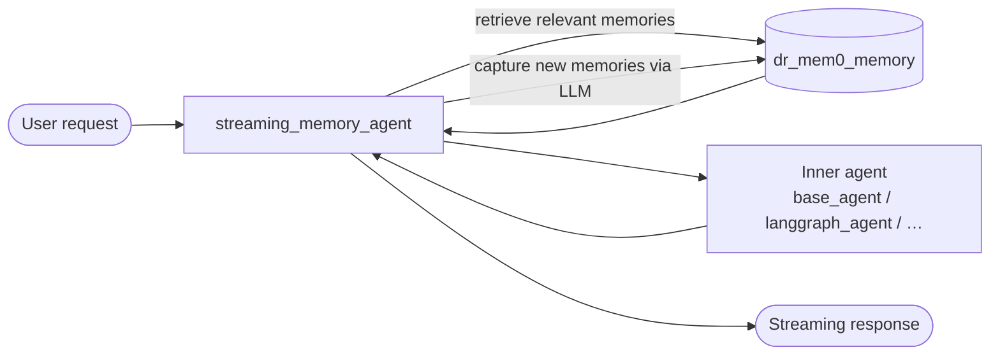

# Agent memory

> **Also known as**: persistent memory, long-term memory, user memory, mem0, DataRobot memory service, conversation memory

The agent can recall facts about a user across conversations. The **runtime shape** of that — how the agent wraps itself in memory retrieval and capture — is described here. The **backend** that stores those memories is not: providers, credentials, TTL, and memory-space LLM routing all belong to the separate [`af-component-memory`](https://github.com/datarobot-community/af-component-memory) component, which documents them in `docs/<memory_name>.md` once added to your project.

> **Note:** **Chat history** (prior `messages` in the same request) is separate from agent memory. All frameworks support multi-turn chat history via `datarobot-genai`; see [Chat history](./chat-history.md).

Memory is **not** implemented in `myagent.py`. The generated `workflow.yaml` wraps your framework agent in a `streaming_memory_agent` that retrieves relevant memories before each turn and captures new ones after.

| Section | Description |
|---|---|
| [How the memory interface works](#how-the-memory-interface-works) | `streaming_memory_agent`, `dr_mem0_memory`, and per-user scoping. |
| [Workflow configuration](#workflow-configuration) | The memory wrapper in `workflow.yaml`. |
| [Adding a memory backend](#adding-a-memory-backend) | Wiring up af-component-memory. |
| [How the agent finds the backend](#how-the-agent-finds-the-backend) | Infra-side discovery, and what it does not do. |
| [Local development](#local-development) | Verifying memory works. |
| [Migrating from in-agent memory](#migrating-from-in-agent-memory) | Pointer to the migration guide for projects generated before the split. |

Enabling memory does **not** change the dependency set. Both providers are already
reachable through `datarobot-genai`, so the generated `pyproject.toml` is identical
either way and the render uses the chosen framework's ordinary `uv.lock`.

---

## How the memory interface works

Agent memory is built on two NAT workflow types from `datarobot-genai`:

| Component | `_type` | Role |
|---|---|---|
| Memory backend | `dr_mem0_memory` | Stores and retrieves memories for the current user. Despite the name, this backend works with any provider the memory component configures — it is selected at runtime from the runtime parameters and credentials it receives. |
| Memory wrapper | `streaming_memory_agent` | Wraps your inner agent. Before each turn it searches memory for relevant context; after each turn it uses an LLM to extract and store durable facts. |


```mermaid
flowchart LR
    User([User request]) --> SMA[streaming_memory_agent]
    SMA -->|retrieve relevant memories| Mem[(dr_mem0_memory)]
    Mem --> SMA
    SMA --> Inner[Inner agent<br/>base_agent / langgraph_agent / …]
    Inner --> SMA
    SMA -->|capture new memories via LLM| Mem
    SMA --> Response([Streaming response])
```

### Per-user scoping

`streaming_memory_agent` is registered as a per-user function. Each authenticated user gets an isolated memory namespace, so memories from one user are not visible to another.

### Automatic capture and retrieval

You do not call memory APIs from application code. The wrapper:

1. Retrieves — searches stored memories for entries relevant to the current user message and injects them into the agent context.
2. Captures — after the inner agent responds, uses the configured LLM to decide which parts of the exchange are worth persisting, then writes them to the memory backend.

The LLM used for capture and retrieval is the workflow `llm_name` (typically `datarobot_llm`). This is the *agent's* LLM, and is independent of the memory backend's own LLM where the provider has one.

---

## Workflow configuration

Every framework template emits the memory wrapper unconditionally. `streaming_memory_agent` is a **passthrough when no backend is configured**, so it is always safe to leave in place — an agent with no memory component behaves exactly as if the wrapper were absent.

```yaml
functions:
  base_agent:
    _type: base_agent
    llm_name: datarobot_llm
    description: Base agent example

memory:
  mem0_memory:
    _type: dr_mem0_memory

workflow:
  _type: streaming_memory_agent
  inner_agent_name: base_agent
  memory_name: mem0_memory
  llm_name: datarobot_llm
  description: Base agent example with automatic memory capture and retrieval
```

### Workflow fields

| Field | Description |
|---|---|
| `inner_agent_name` | Name of the function in `functions` that performs the actual agent work. |
| `memory_name` | Name of the entry under `memory` that points to the `dr_mem0_memory` backend. The template uses `mem0_memory`. |
| `llm_name` | LLM used by the memory wrapper for retrieval ranking and post-turn memory extraction. |

### Framework-specific inner agents

| Framework | `inner_agent_name` | Inner `_type` |
|---|---|---|
| Base | `base_agent` | `base_agent` |
| LangGraph | `langgraph_agent` | `langgraph_agent` |
| CrewAI | `crewai_agent` | `crewai_agent` |
| LlamaIndex | `llamaindex_agent` | `llamaindex_agent` |
| NAT | `nat_agent` | `per_user_tool_calling_agent` |

For NAT, the inner `per_user_tool_calling_agent` retains its `tool_names` (planner, writer, MCP tools, and so on). The outer `streaming_memory_agent` adds memory on top without changing tool wiring.

To remove memory entirely, replace the `streaming_memory_agent` workflow block with the inner agent's own `_type` and delete the `memory` section.

---

## Adding a memory backend

Two things are needed, **in this order**:

1. **Add the memory component** to the project:

   ```sh
   dr component add af-component-memory
   ```

   It asks which provider to use, renders `infra/infra/<memory_name>.py` alongside the agent's infra, and writes `.datarobot/answers/memory-<memory_name>.yml`. Provider choice, API keys, TTL, and memory-space LLM routing are all configured there — see its generated `docs/<memory_name>.md`.

2. **Generate or update the agent**, pointing `memory_answers_file` at the answers file from step 1. To pass it non-interactively:

   ```sh
   uvx copier copy . ./my-agent \
     --data memory_answers_file=.datarobot/answers/memory-memory.yml
   ```

   The default assumes the DataRobot Memory Service, whose instance is named `memory`. Mem0 names its instance `mem0_memory`, so that project needs `.datarobot/answers/memory-mem0_memory.yml`.

There is no separate on/off question — `memory_answers_file` resolving is the signal, exactly as `llm_answers_file` is for the LLM component. The order matters: the agent's infra imports the memory module by the name recorded in that file, so it must exist before the agent renders.

> **A path that does not resolve means "no memory", not an error.** That is what keeps memory optional, but it also means a typo silently disables it. Copier does warn when the path does not resolve:
>
> ```
> MissingFileWarning: File not found; returning empty dict: .datarobot/answers/memory-memory.yml
> ```
>
> It is a warning, not an error, and easy to miss in a long render. After rendering, confirm `base.py` contains a `from ..<memory_name> import` line.

---

## How the agent finds the backend

The same way it finds the LLM component. `memory_answers_file` is read as Copier external data, the memory instance's module name comes out of it, and `infra/infra/<agent_app_name>_infra/base.py` imports that module directly:

```python
from ..memory import custom_model_runtime_parameters as memory_custom_model_runtime_parameters
```

Those parameters are concatenated into the shared runtime-parameter list next to the LLM component's, with no discovery step in between. The module name is not fixed — af-component-memory names it after the memory instance (`memory` for the DataRobot Memory Service, `mem0_memory` for Mem0) — which is exactly why it has to be read from the answers file rather than guessed.

Two consequences worth knowing:

- **The agent creates no memory resources.** No credential, no memory space. The memory component creates whatever it needs and exports already-resolved values, including credential IDs. That is what keeps memory runtime-agnostic — the Custom Models and Workload API paths consume the identical parameter list, and neither one creates, re-creates, or reaches into a memory credential.
- **One memory component per agent.** `memory_answers_file` names a single instance. A second memory component's runtime parameter keys would collide with the first's, so it is not wired in.

Adding a provider, or changing how one is configured, is therefore a change to `af-component-memory` alone. Nothing in the agent template needs to know a provider exists.

---

## Local development

1. Configure the backend as described in the memory component's own docs, then apply infra so its runtime parameters reach the agent:

   ```sh
   task deploy-dev
   ```

2. Start the agent:

   ```sh
   dr run agent:dev
   ```

3. Send repeated prompts under the same user identity across separate conversations, and confirm facts from earlier turns are recalled.

If memory appears to do nothing, check `base.py` for the `from ..<memory_name> import` line first. Absent, `memory_answers_file` did not resolve. Present, the module is wired in but the backend is not configured — `streaming_memory_agent` passes through when it has no backend, so check the memory component's own settings.

---

## Migrating from in-agent memory

Projects generated before the split stored a provider directly in the agent's answers (`use_agent_memory: mem0` or `use_agent_memory: datarobot_memory_service`). That answer no longer exists, and for `datarobot_memory_service` the existing memory space is **destroyed** on the next `pulumi up` unless you act first.

See [agent memory migration](./migration-agent-memory.md) for the full procedure and the warning.

---

## Further reading

| Topic | Description |
|---|---|
| [Agent README](./README.md) | Agent component overview, front server, and framework guides. |
| [DRAgent front server](./README.md#front-server) | DRAgent runtime overview (required for memory). |
| [LLM provider fallback](./llm-fallback.md) | Configure primary and fallback LLMs used by the memory wrapper and inner agent. |
